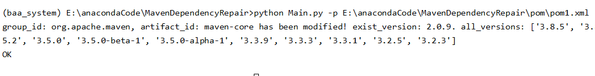
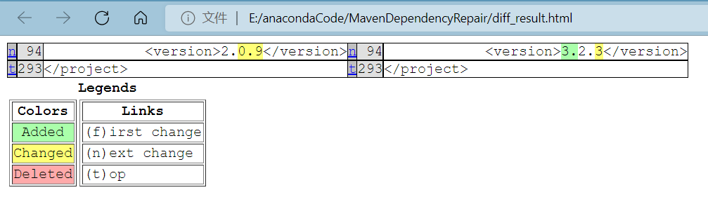

# MavenDependencyRepair
This project is used to deal with invalidation of maven dependency

## File description
1. pom: This directory has some file with .xml as the suffix which used to do some tests.
2. Main.py: This file is the enter of the project.
3. test.py: It has some code snippets related to compare two files.
4. diff_result.html: A file that is automatically generated by the program. It contains information of differences between two files.

## Environment
+ Linux/Windows
+ python 3.7

## Requirements
+ requests==2.25.1
+ filestools==0.1.2

## Usage
+ Use <code>python main.py -p <file_path></code> to repair invalid maven dependency in a **pom.xml** file.
+ Use <code>python test.py -o <file_path> -t <file_path></code> to compare two files and get differences between two files and save as **diff_result.html**.

### Example
+ First, you can create two files named pom_origin.xml and pom.xml (which has been created in **pom** directory). This two file have the same content.
+ Second, use <code>python main.py -p ./pom/pom.xml</code> to repair invalid dependency in pom.xml. 
    + If one dependency has been repaired successfully, terminal will print information related to this dependency.
    + If this pom.xml has been repaired successfully, terminal will print "OK".  
      
+ Third, use <code>python main.py -o ./pom/pom_origin.xml -t ./pom/pom.xml</code> to get differences between two files. The differences between two files will be saved as **diff_result.html**. This html file can be viewed in a browser.  

